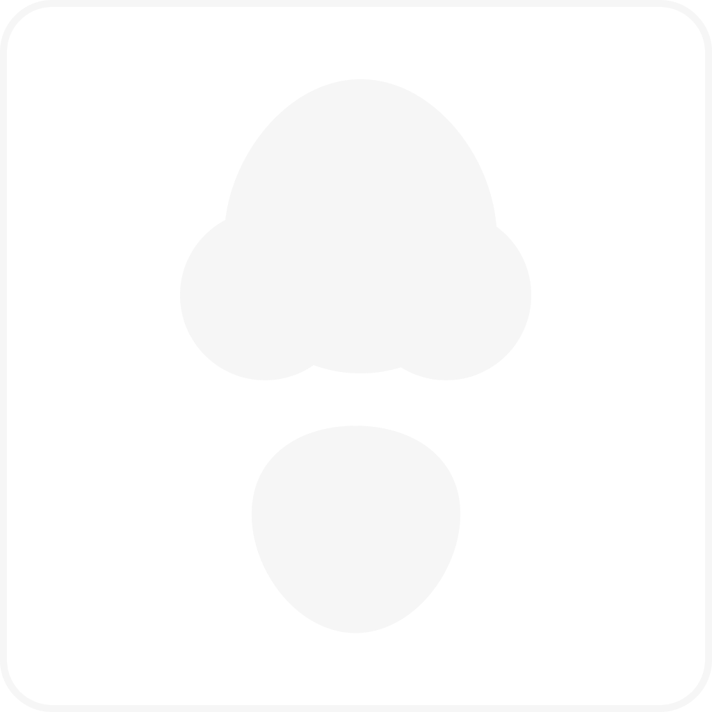
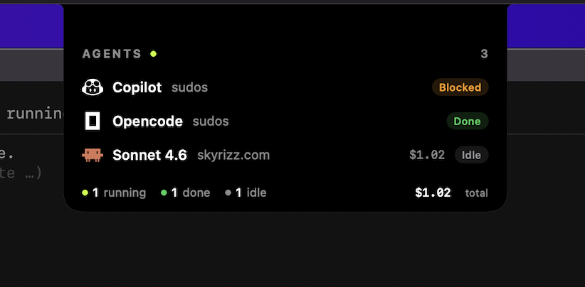

# bohay

<div align="center">



**The terminal workspace for AI coding agents.**

Run Claude Code, Copilot, Codex, opencode, and more — side by side, in one window,
with a live view of what every agent is doing.

[](https://crates.io/crates/bohay)
[](https://github.com/RizRiyz/bohay/actions/workflows/ci.yml)
[](https://bohay.pages.dev/docs/)


**[Website](https://bohay.pages.dev)** · **[Documentation](https://bohay.pages.dev/docs/)** · **[Releases](https://github.com/RizRiyz/bohay/releases)**

<br />


</div>

## Why bohay?

Working with AI coding agents usually means juggling terminal windows: one agent is
waiting for permission while you watch another one think, and a third finished ten
minutes ago without you noticing. bohay fixes that.

- **See everything at once.** A sidebar shows every agent's live state — *blocked*,
  *working*, *done*, or *idle* — across all your projects. Get a silent desktop
  notification the moment one needs you.
- **Never lose a session.** Panes survive closing the terminal. Reattach and every
  shell, layout, and agent conversation is exactly where you left it — bohay resumes
  each agent's own session automatically, no flags to remember.
- **Run agents in parallel, safely.** A built-in task board coordinates multiple
  agents on one repository: each worker gets an isolated git worktree, file-path
  leases stop them from colliding, and finished branches merge through a gate.
- **Stay in the terminal.** A git dashboard (branches, commits, PRs, issues), a
  folder picker, worktree management, remote sessions over SSH, and a full
  scripting API — without leaving your keyboard.

All of it ships as a **single Rust binary**: fast, native, ~3 MB on disk, and a
memory footprint measured in single-digit megabytes.

## Install

```bash
# macOS (Apple silicon) / Linux — prebuilt binary, no Rust needed
curl -fsSL https://raw.githubusercontent.com/RizRiyz/bohay/main/install.sh | sh

# Homebrew
brew install RizRiyz/bohay/bohay

# Cargo (Rust ≥ 1.82) — any platform, incl. Intel macs
cargo install bohay
```

```powershell
# Windows — prebuilt binary, no Rust needed (run in PowerShell)
irm https://raw.githubusercontent.com/RizRiyz/bohay/main/install.ps1 | iex
```

On Windows, use bohay inside **Windows Terminal**. Live cwd tracking and the shell
integration hook aren't available there, but agent resume still works. You can also
grab the `…-x86_64-pc-windows-msvc.zip` from the
[releases page](https://github.com/RizRiyz/bohay/releases) directly.

## Quick start

```bash
bohay          # launch — or reattach to — your session
bohay doctor   # check your setup: git, gh, ssh, and what each unlocks
```

`bohay` starts a background server that owns your panes, then attaches a
lightweight client. **Close the terminal any time** — everything keeps running.
Run `bohay` again to reattach. Detach explicitly with `Ctrl+Space` `q`; end
everything with `bohay server stop`.

Open any folder as a workspace with `Ctrl+Space` `N` (or just run `bohay` inside
it), split panes, and start your agents like you normally would. bohay recognizes
them automatically.

> **macOS note:** the system reserves `Ctrl+Space` for input-source switching by
> default, which blocks bohay's prefix key. Free it under **System Settings →
> Keyboard → Keyboard Shortcuts… → Input Sources** (untick *Select the previous
> input source*). Everything is also fully mouse-driven, and pane scrolling needs
> no prefix at all, so you're never locked out in the meantime.

## Supported agents

| Agent | Live status | Session resume | Precise events (hook) |
|---|:---:|:---:|:---:|
| Claude Code | ✓ | ✓ | ✓ |
| GitHub Copilot CLI | ✓ | ✓ | ✓ |
| Codex | ✓ | ✓ | ✓ |
| opencode | ✓ | ✓ | ✓ |
| Cursor | ✓ | resume command | — |
| Gemini · Aider · Amp · Droid | ✓ | — | — |

*Live status* works out of the box for every agent — no setup. *Session resume*
reopens the agent's own conversation after a restart, discovered automatically
from its session store. The optional *hook* (`bohay integration install claude`,
also available from **Settings → Integrations**) reports exact session ids and
lifecycle events; `bohay integration uninstall` removes only bohay's hook and
never touches the agent itself.

## The macOS notch companion

<div align="center">



</div>

**bohay-notch** is a native SwiftUI app that lives in your notch and menu bar.
Hover, and it drops a live panel of your agents — logo, model, project, running
cost, and state — with a one-glance footer of how many are running, done, or idle.
A blocked agent surfaces an approve card right in the notch; clicking any agent
jumps to its pane in bohay.

```bash
brew install --cask --no-quarantine RizRiyz/bohay/bohay-notch
```

Requires macOS 15+. The app is ad-hoc signed (not notarized), hence
`--no-quarantine`; alternatively download the `.dmg` from the
[releases page](https://github.com/RizRiyz/bohay/releases) and run
`xattr -dr com.apple.quarantine /Applications/bohay-notch.app` once.

## Everyday use

### Keybindings

Press **`Ctrl+Space`**, then a key. **`Ctrl+Space ?`** shows the full cheat-sheet,
and every shortcut is remappable in **Settings → Keys**.

| Key | Action | Key | Action |
|-----|--------|-----|--------|
| `←↓↑→` / `hjkl` | focus pane | `c` | new tab |
| `v` / `s` | split right / down | `n` `p` `⇥` | cycle tabs |
| `x` | close pane | `N` | new workspace (pick a folder) |
| `z` | zoom pane | `w` `W` | cycle workspaces |
| `b` | toggle sidebar | `g` / `G` | git tab / new worktree |
| `o` | orchestration board | `,` | open Settings |
| `q` `d` | detach | `⇧↑` | scroll pane history |

### Scrollback

Scroll any pane with the mouse wheel or two-finger scroll — or press **`Shift+↑`**
(no prefix needed) to enter *scroll mode*: `1`–`9` jump through history (1 =
oldest, 9 = newest), `j`/`k` move by line, `f`/`b` by page, `g`/`G` top/bottom,
and `q` — or just typing — snaps back to live. A `↑N` badge shows how far up you
are. Full-screen apps (vim, TUI agents) keep their own scrolling; bohay forwards
the wheel to them.

### Copy text

Drag across a pane to select; releasing copies to your system clipboard and
flashes a *Copied* toast. Works locally and over SSH (native clipboard + OSC 52).

## Git, built in

Click a workspace's branch in the sidebar (or `Ctrl+Space g`) to open a
keyboard-driven git dashboard: **Commits · Flow · Branches · PRs · Issues ·
Status**, including full PR detail — checks, reviews, mergeability — with
merge/approve/checkout without leaving the terminal. GitHub data comes from the
`gh` CLI; without it, the tab still works as a local git viewer.

**Worktrees are first-class:** `Ctrl+Space G` creates a git worktree for a branch
and opens it as its own workspace, nested under the repo in the sidebar — work on
several branches at once without stashing.

## Multi-agent orchestration

Run several agents on one project **in parallel, without conflicts**. Open the
board with `Ctrl+Space o`:

- **Task board** — add tasks with dependencies, watch them flow from queued to done.
- **Isolated workers** — each started task gets its own git worktree and pane.
- **Path leases** — workers lease the file globs they'll touch; overlapping claims
  are rejected, so two agents can never edit the same files at once.
- **Quality gates** — a task can require a command (say, `cargo test`) to pass
  before it counts as done.
- **Safe merging** — finished branches integrate through a dedicated merge
  worktree; your checkout is never touched.

Everything on the board is also scriptable (`bohay task …`, `bohay lease …`), so
an orchestrator agent can drive the whole flow itself.

## Remote sessions

```bash
bohay --remote my-server
```

Runs (or reattaches) a session on another machine over **plain SSH** — no
port-forwarding, no extra daemon. Only changed screen cells cross the wire
(a keystroke is ~22 bytes), so it stays snappy on slow links. Detach locally,
reattach from anywhere.

## Scriptable to the core

Every UI action is a command over a local socket — what you can click, an agent
can script:

```bash
bohay pane split --down            # split the focused pane
bohay pane run 7 cargo test        # run a command in pane 7
bohay wait output 7 --match ok     # block until text appears (exit 0; 2 on timeout)
bohay agent list                   # every agent, everywhere
bohay events                       # stream agent-status changes live
```

Commands run inside a bohay pane default to that pane automatically (via the
injected `$BOHAY_PANE_ID`).

<details>
<summary><b>Full command reference</b> — every CLI &amp; agent-API command (or run <code>bohay help</code>)</summary>

```text
workspaces
  workspace list                          list workspaces
  workspace new                           create a workspace in the current directory
  workspace open <path>                   open <path> as a workspace (or focus it)
  workspace focus <i>                     focus workspace i (0-based)
  workspace close [<i>]                   close a workspace (default: active)

tabs
  tab list | new | focus <n> | close [<n>]

panes
  pane list                          list panes in the current tab
  pane split [<id>] [--down]         split a pane (default: side by side)
  pane focus <id>                    focus a pane (jumps to its workspace/tab)
  pane run  [<id>] <cmd...>          run a command in a pane
  pane send [<id>] <text>            send raw text to a pane
  pane read [<id>]                   print a pane's recent output
  pane status [<id>]                 print a pane's agent status (any workspace)
  pane close [<id>]                  close a pane

agents
  agent list                         every agent across all workspaces/tabs
  agent sessions                     resumable sessions found on disk
  agent resume <id>                  reopen a resumable session into a pane
  wait output <id> --match <text> [--timeout <s>]                block until output appears
  wait agent-status <id> --status done|blocked|working|idle [--timeout <s>]
  attach <id>                        open the TUI into one fullscreen pane

git
  git status | branches | log [--limit N] | open [<workspace>]

worktrees
  worktree list                      list the current repo's worktrees
  worktree create <branch>           create a worktree + workspace for <branch>
  worktree open <path>               open an existing worktree as a workspace
  worktree remove <path>             remove a worktree (its branch is kept)

orchestration (multiple agents, one project — Ctrl+Space o for the board)
  task add "<title>" [--paths <glob>...] [--dep <id>...] [--gate <cmd>]
  task list | get <id> | update <id> | claim <id> | release <id>
  task next [--start] [--agent <cmd>]   claim the next ready task (--start = worktree worker)
  task start <id> [--branch <b>] [--agent <cmd>]   spawn an isolated worktree worker
  task heartbeat <id> --context <0..1>   report context usage (blocks done at >85%)
  task done <id>                     mark done (runs its quality gate)
  task merge <id>                    integrate the branch into bohay/integration (safely)
  lease acquire <glob>... --task <id> | list | release <id>

modules (extensions)
  module search [<query>]            find modules on the `bohay-module` GitHub topic
  module list | info <id> | actions
  module link <path>                 register a local module dir
  module install <owner>/<repo>[/sub] [--ref REF] [--yes]
  module unlink <id> | uninstall <id> | enable <id> | disable <id>
  module run <id> <action>           invoke an action (captures + logs output)
  module pane open <id> <entrypoint> [--placement split|overlay|tab]
  module pane focus <pane> | close <pane>
  module log [<id>] [--limit N] | config-dir <id>

appearance / events / server
  ui sidebar --width <n> | --hide | --show
  events                             stream live status changes
  --remote <host> [ssh args]         attach to a session on <host> over plain ssh
  ping | doctor | server status | start | stop | restart
  integration install|uninstall <claude|copilot|codex|opencode>   session-resume hook
```

</details>

### Extensions

A **module** is a directory with a small TOML manifest declaring commands — any
language, no SDK. Modules call back through the same socket API and can open
their own panes. Discover community modules with `bohay module search`, install
with `bohay module install owner/repo` (every command is previewed and confirmed
before anything runs). See the [module guide](MODULE-GUIDE.md) to build your own.

## Configuration

All state lives in **`~/.bohay/`** (override with `$BOHAY_HOME`):

| File | What it holds |
|---|---|
| `config.json` | theme, layout, notifications, keybindings, language |
| `session.json` | your workspaces/tabs/panes snapshot (auto-saved) |
| `orch.json` | the orchestration task ledger |

Theme (10 built-in), layout, notifications, keys, modules, integrations, and UI
language (**8 languages**) are all editable live in the **Settings** menu — the
**Menu** button top-right, or `Ctrl+Space ,`.

## Troubleshooting

- **`bohay doctor`** diagnoses most setups: it checks `git`, `gh`, `ssh`, and
  tells you what each unlocks.
- **`Ctrl+Space` does nothing on macOS** → see the note in [Quick start](#quick-start).
- **Upgraded but nothing changed?** The old server may still be running — bohay
  warns you on attach; run `bohay server restart` (your session is saved and
  restored).

## Development

```bash
cargo build            # pure Rust, no C toolchain
cargo test             # unit + off-screen render tests (no tty needed)
cargo clippy --all-targets -- -D warnings
cargo run -- --local   # client + server in one process
```

Architecture in one line: a headless **server** owns the panes and renders frames
into an off-screen buffer; a thin **client** blits them to your terminal; state is
pure and driven by a single event loop. Debug builds use `~/.bohay-dev/`, so
hacking on bohay never touches your real session.

Contributions are welcome — start with [CONTRIBUTING.md](CONTRIBUTING.md).
Security reports: see [SECURITY.md](SECURITY.md).

## License

[MIT](LICENSE)
