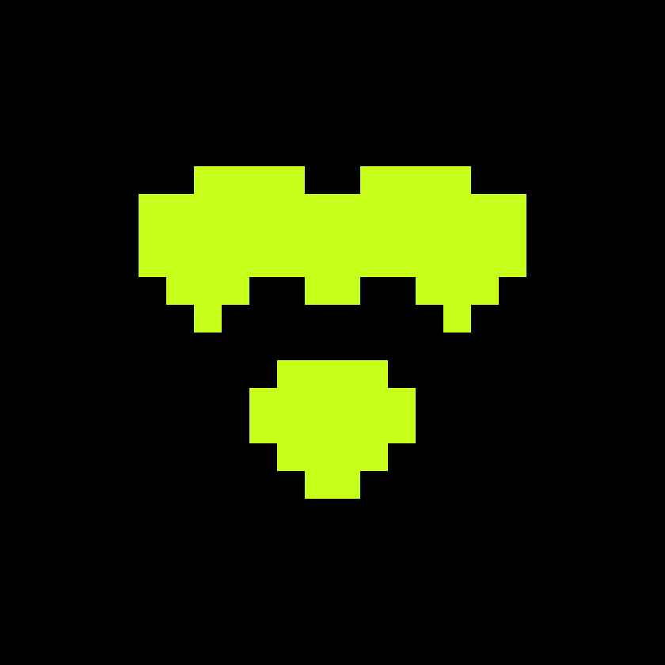

# Luvus

<div align="center">



**Mission control for your AI coding agents.**

[](https://crates.io/crates/luvus)
[](https://github.com/RizRiyz/luvus/actions/workflows/ci.yml)
[](https://luvus.dev/docs/)


**[Website](https://luvus.dev)** · **[Documentation](https://luvus.dev/docs/)** · **[Releases](https://github.com/RizRiyz/luvus/releases)**

<br />

<a href="assets/video.mp4"></a>

</div>

## Why luvus?

Working with AI coding agents means juggling terminal windows — one waits for
permission while you watch another think, and a third finished ten minutes ago
without you noticing. luvus puts them all in one place.

- **See every agent at once.** One sidebar shows what each agent is doing —
  *blocked · working · done · idle* — across every project, and `Ctrl+Space .`
  jumps straight to whichever one is waiting on you. *Working* needs on-screen
  proof, so a launching CLI or your own typing never reads as busy.
- **Never lose a session.** Close the terminal and nothing stops. Run `luvus`
  again and every pane, tab, and layout is back, with each agent's own
  conversation resumed automatically — no flags to remember. Fork a session into
  a new pane to try a second approach without giving up the first.
- **Read the files your agents touch.** A file tree tinted by git status, and a
  fast built-in viewer that marks what changed against your last commit. Open
  anything in vim, nano, or your `$EDITOR` without leaving the terminal.
- **Run a team of agents safely.** A task board gives each worker its own git
  worktree and leases on the files it will touch, then merges finished branches
  through a quality gate.
- **Git without leaving the terminal.** Commits, branches, PRs, and issues in a
  built-in dashboard, with worktrees as first-class workspaces.
- **Work from anywhere.** Attach to a session over plain SSH — only the cells
  that changed cross the wire — and the layout adapts down to a phone screen.
- **Scriptable and extensible.** Every action in the UI is also a CLI command
  over a local socket, and modules in any language plug in through a small TOML
  manifest.
- **Make it yours.** 15 themes, fully remappable keys, movable sidebar docks, and
  a UI in 8 languages.

Ships as a single **~3 MB Rust binary** — fast, native, memory measured in
single-digit megabytes.

## Install

```bash
# macOS (Intel + Apple silicon) / Linux — prebuilt binary, no Rust needed
curl -fsSL https://luvus.dev/install.sh | sh

brew install RizRiyz/luvus/luvus      # Homebrew (also a prebuilt binary)
cargo install luvus                   # build from source (needs Rust 1.88+)
```

```powershell
# Windows (PowerShell) — use luvus inside Windows Terminal
irm https://luvus.dev/install.ps1 | iex
```

### Upgrading from Bohay 0.10.2

Install Luvus, then run the migration from a normal terminal outside Bohay:

```bash
curl -fsSL https://luvus.dev/install.sh | sh
curl -fsSL https://luvus.dev/migrate.sh | sh
luvus
```

The migration script stops default and named servers, preserves any existing
`~/.luvus/` state as a timestamped backup, and asks Luvus to copy durable state
from `~/.bohay/` without deleting the old directory. Sessions, settings,
manifests, modules, and named sessions carry over; runtime sockets, locks, and
managed worktrees are not duplicated. Existing worktree paths remain valid
because the Bohay directory is left untouched. Keep it until you have verified
the migration.

## Quick start

```bash
luvus          # launch — or reattach to — your session
luvus doctor   # check your setup: git, gh, ssh
```

Open any folder with `Ctrl+Space` `N` (or run `luvus` inside it), split panes,
and start your agents — luvus recognizes them automatically.

> **macOS:** free the `Ctrl+Space` prefix under *System Settings → Keyboard →
> Keyboard Shortcuts → Input Sources* (untick *Select the previous input source*).
> Everything is mouse-driven too, so you're never locked out.

## Codex skill

Luvus does not install agent instructions by default. Explicitly enable the
Codex skill when you want Codex to inspect and control your local Luvus session:

```bash
luvus skill enable codex
```

Start a new Codex thread after enabling it. See the
[Codex skill guide](https://luvus.dev/docs/guides/codex-plugin/) for delegation,
permissions, and production setup.

## Supported agents

| Agent | Live status | Session resume | Precise events (hook) |
|---|:---:|:---:|:---:|
| Claude Code | ✓ | ✓ | ✓ |
| GitHub Copilot CLI | ✓ | ✓ | ✓ |
| Codex | ✓ | ✓ | ✓ |
| opencode | ✓ | ✓ | ✓ |
| Kimi | ✓ | ✓ | ✓ |
| Grok | ✓ | ✓ | ✓ |
| Pi | ✓ | ✓ | — |
| Cursor | ✓ | resume command | — |
| Gemini · Aider · Amp · Droid · Qwen · Kiro | ✓ | — | — |

Live status works out of the box for every agent, with no setup.

→ Full guides, keybindings, and the complete CLI reference live at
**[luvus.dev/docs](https://luvus.dev/docs/)**. Run `luvus --help` for the compact
overview, `luvus help <topic> [command]` for focused guidance, or
`luvus help all` for the complete reference.

## Development

```bash
cargo build            # pure Rust, no C toolchain
cargo test             # unit + off-screen render tests (no tty needed)
cargo run -- --local   # client + server in one process
```

A headless **server** owns the panes and renders frames into an off-screen buffer;
a thin **client** blits them to your terminal; state is pure, driven by one event
loop. Debug builds use `~/.luvus-dev/`, so hacking never touches your real session.

Contributions welcome — see [CONTRIBUTING.md](CONTRIBUTING.md). Security reports:
[SECURITY.md](SECURITY.md).

## License

[GNU AGPL v3](LICENSE) (`AGPL-3.0-or-later`).

luvus is free software: you can redistribute it and/or modify it under the terms of the GNU Affero General Public License. If you run a modified luvus as a network service, the AGPL requires you to offer its source to that service's users. See the [LICENSE](LICENSE) for the full terms.
